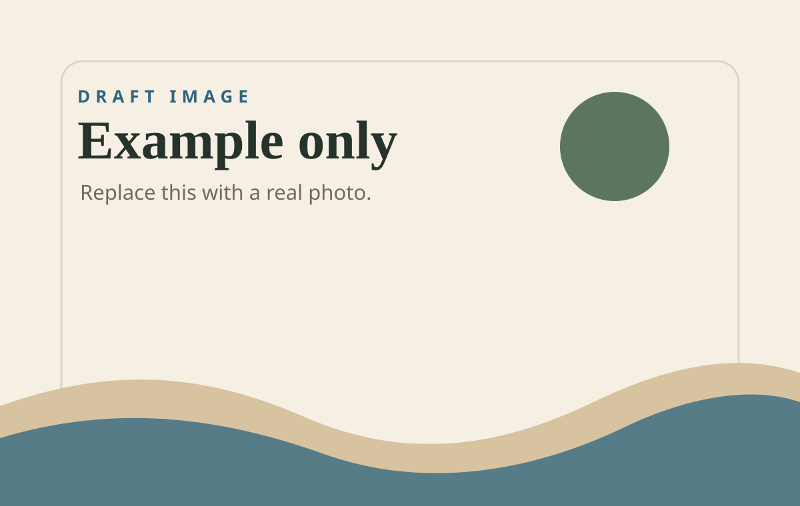

# Example Monthly Update

This draft is not listed in `manifest.json`, so it will not appear in the archive.
Copy it when you are ready to write the first real update.

## A few photos

*Write a short caption in italics directly under the image.*

## What happened

Write the update like a normal note. Markdown is enough:

- short lists
- links
- photos
- captions
- a closing paragraph

## Small thing worth remembering

The point is not to make this polished. The point is to make it easy to send
the details I usually forget to send.
