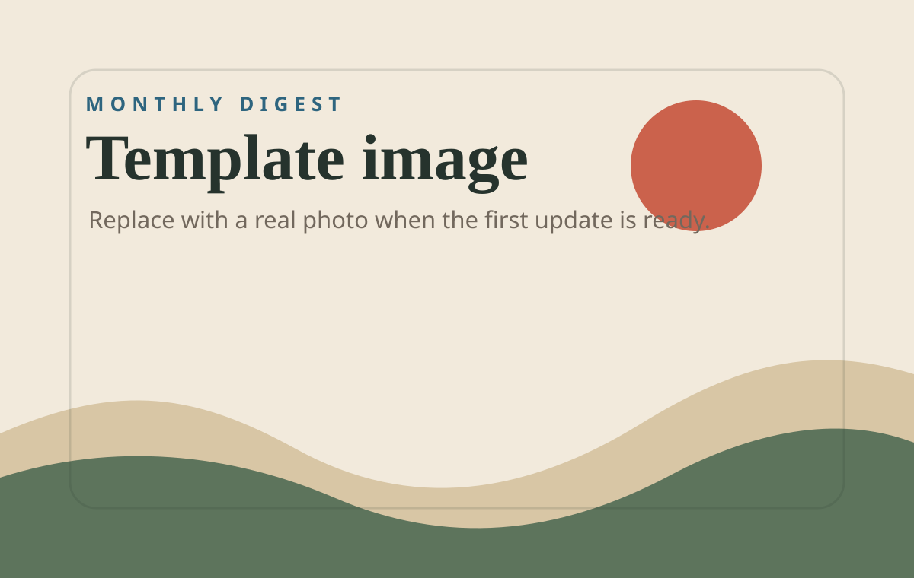

# Template Update

This is a sample monthly update. Replace this file when you are ready to write
the first real one, or copy it and rename the copy by month.

## The short version

This is where the actual update goes: what happened, where I went, what I saw,
and the details I would usually forget to send.

*Captions go directly under images in italics. Keep them short and specific.*

## A few notes

- One thing that happened.
- One photo worth explaining.
- One small detail Mom would have asked about anyway.

## How to publish the real first post

1. Copy this file to `blog/posts/2026-07.md`.
2. Add images to `blog/assets/2026-07/`.
3. Add the post to `blog/manifest.json`.
4. Delete or unpublish this template entry when you no longer need it.
